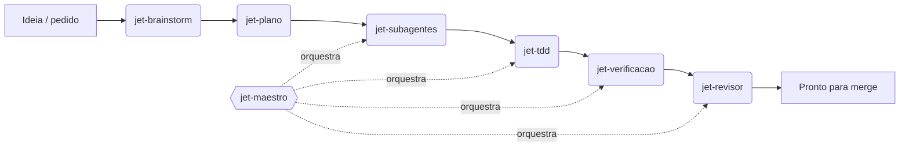

# JET Skills

> O sistema de agentes que a JET Digital usa para tocar projetos de dev e de agência com Claude Code — não uma coleção de prompts soltos, mas um time com papéis, fronteiras e um método de trabalho comum.

A JET não escreve um prompt novo a cada tarefa. Construiu um **time fixo de agentes especializados** — cada um com escopo claro, ferramentas certas e guardrails de segurança — e um punhado de **skills de processo** que garantem que qualquer um deles trabalhe do mesmo jeito: explora antes de decidir, planeja antes de codar, testa antes de implementar, verifica antes de dizer "pronto".

Este repositório publica esse sistema inteiro: 15 agentes e 6 skills, prontos para instalar no Claude Code.

---

## O time

15 agentes, agrupados por onde atuam. Cada um entrega em arquivo/commit — nenhum publica em produção nem faz merge sozinho.

### Dev

| Agente | O que faz |
|---|---|
| [`jet-dev-backend`](agents/jet-dev-backend/) | Lógica de servidor, APIs e serviços — TDD do início ao fim, na stack de backend do projeto. |
| [`jet-dev-frontend`](agents/jet-dev-frontend/) | HTML/CSS/JavaScript e o framework do projeto — UI, acessibilidade e testes E2E, em TDD. |
| [`jet-dev-dados`](agents/jet-dev-dados/) | PostgreSQL: schema, migrações, índices e performance de query, sempre com baseline medido antes/depois. |
| [`jet-dev-devops`](agents/jet-dev-devops/) | Containers, CI/CD e deploy — infra como código, rollback documentado antes de qualquer deploy. |
| [`jet-implementador`](agents/jet-implementador/) | Generalista do time dev — implementa uma task de um plano em TDD, sem especialidade fixa. |

### Agência

| Agente | O que faz |
|---|---|
| [`jet-copywriter`](agents/jet-copywriter/) | Copy de anúncio, página, e-mail e CTA — ângulo de persuasão e tom de voz por marca. |
| [`jet-trafego`](agents/jet-trafego/) | Estrutura de campanha, criativos, segmentação e leitura de métrica em Meta Ads e Google Ads. |
| [`jet-seo`](agents/jet-seo/) | Pesquisa de keyword, briefs de artigo, clusters de conteúdo e otimização on-page. |
| [`jet-designer`](agents/jet-designer/) | Layout, wireframes, protótipos navegáveis, Figma e design system. |
| [`jet-analista-dados`](agents/jet-analista-dados/) | Dashboards, GA4 e relatório de performance traduzido em insight de negócio. |
| [`jet-gestor-projetos`](agents/jet-gestor-projetos/) | Transforma pedido de cliente em tarefas com dono e prazo, acompanha status e destrava bloqueio. |

### Processo

| Agente | O que faz |
|---|---|
| [`jet-maestro`](agents/jet-maestro/) | Orquestra o loop autônomo do time — pega a próxima task, delega ao especialista certo, registra o resultado. |
| [`jet-revisor`](agents/jet-revisor/) | Revisa o diff de uma task em dois eixos — conformidade com o spec e qualidade/segurança — só leitura. |
| [`jet-pesquisador`](agents/jet-pesquisador/) | Deep research multi-fonte na web, verificado de forma adversarial, com relatório citado. |
| [`jet-doc`](agents/jet-doc/) | Escreve e atualiza documentação de engenharia — ADR, README, PRD, runbooks. |

---

## As skills de processo

6 skills que qualquer agente (ou o próprio Claude Code) invoca durante o trabalho — é o que faz o time inteiro seguir o mesmo método.

| Skill | O que faz |
|---|---|
| [`agent-architect`](skills/agent-architect/) | Guia estruturado para planejar a arquitetura de um agente de IA, camada por camada, com custo estimado. |
| [`jet-brainstorm`](skills/jet-brainstorm/) | Transforma uma ideia solta em design aprovado pelo usuário, antes de qualquer linha de código. |
| [`jet-plano`](skills/jet-plano/) | Transforma um spec aprovado em plano de implementação bite-sized, pronto para execução por subagentes. |
| [`jet-subagentes`](skills/jet-subagentes/) | Executa um plano despachando um subagente por tarefa, com revisão em cada gate. |
| [`jet-tdd`](skills/jet-tdd/) | Impõe o ciclo RED → GREEN → REFACTOR → commit em qualquer mudança de código. |
| [`jet-verificacao`](skills/jet-verificacao/) | Exige evidência de verificação fresca — comando rodado e output lido — antes de qualquer alegação de "pronto". |

---

## Como o sistema se encaixa

Uma feature não vira código direto. Ela passa por um funil de skills, com o `jet-maestro` orquestrando a entrega entre os agentes:



Na prática: `jet-brainstorm` converge a ideia num design aprovado; `jet-plano` quebra o design em tasks bite-sized; `jet-subagentes` despacha um agente especialista por task; cada task roda em `jet-tdd` (RED → GREEN → REFACTOR); `jet-verificacao` bloqueia qualquer "terminei" sem evidência fresca; e `jet-revisor` audita o diff antes de seguir. O `jet-maestro` é quem fecha o loop sozinho quando o trabalho é autônomo — sem ele, o time roda sob comando direto do humano, um agente de cada vez.

---

## Como instalar

Funciona com Claude Code. Copie a pasta do agente ou da skill para o diretório correspondente do seu ambiente:

```bash
# um agente
cp -r agents/jet-dev-backend ~/.claude/agents/

# uma skill
cp -r skills/jet-tdd ~/.claude/skills/

# o time inteiro
cp -r agents/* ~/.claude/agents/
cp -r skills/* ~/.claude/skills/
```

Cada agente e cada skill tem seu próprio README com o que faz, quando usar e um exemplo — comece por ali antes de instalar.

---

## O que vem a seguir

A JET construiu o **Nexo** para orquestrar esse time num canvas só — [em breve](https://wearejet.digital).

---

## Sobre a JET

Desenvolvido e mantido pela [JET Digital](https://wearejet.digital) — estúdio de tecnologia e growth especializado em web design, inteligência comercial, SEO & GEO, performance e sistemas.

Parte deste conteúdo é adaptação de um toolkit de terceiros; a atribuição completa (origem, licença e o que é original da JET) está no [`NOTICE`](./NOTICE).

---

*Feito em Criciúma, SC.*
