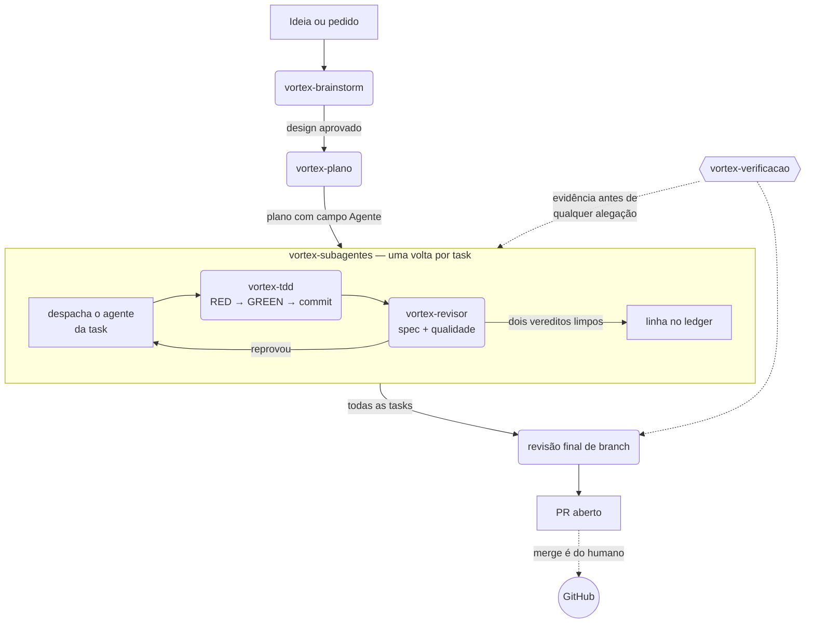

# Vortex Skills

[](CHANGELOG.md)
[](LICENSE)
[](https://claude.com/claude-code)
[](docs/agentes/)
[](docs/skills/)

> O sistema de agentes que a Vortex usa para tocar projetos de dev e de agência com Claude Code — não uma coleção de prompts soltos, mas um time com papéis, fronteiras e um método de trabalho comum.

A Vortex não escreve um prompt novo a cada tarefa. Construiu um **time fixo de agentes especializados** — cada um com escopo claro, ferramentas certas e guardrails de segurança — e um punhado de **skills de processo** que garantem que qualquer um deles trabalhe do mesmo jeito: explora antes de decidir, planeja antes de codar, testa antes de implementar, verifica antes de dizer "pronto".

Este repositório publica esse sistema inteiro como um plugin do Claude Code: 15 agentes, 6 skills de processo, 10 slash commands e 3 gates que rodam como hooks.

---

## O time

15 agentes, agrupados por onde atuam. Cada um entrega em arquivo/commit — nenhum publica em produção nem faz merge sozinho.

### Dev

| Agente | O que faz |
|---|---|
| [`vortex-dev-backend`](docs/agentes/vortex-dev-backend.md) | Lógica de servidor, APIs e serviços — TDD do início ao fim, na stack de backend do projeto. |
| [`vortex-dev-frontend`](docs/agentes/vortex-dev-frontend.md) | HTML/CSS/JavaScript e o framework do projeto — UI, acessibilidade e testes E2E, em TDD. |
| [`vortex-dev-dados`](docs/agentes/vortex-dev-dados.md) | PostgreSQL: schema, migrações, índices e performance de query, sempre com baseline medido antes/depois. |
| [`vortex-dev-devops`](docs/agentes/vortex-dev-devops.md) | Containers, CI/CD e deploy — infra como código, rollback documentado antes de qualquer deploy. |
| [`vortex-implementador`](docs/agentes/vortex-implementador.md) | Generalista do time dev — implementa uma task de um plano em TDD, sem especialidade fixa. |

### Agência

| Agente | O que faz |
|---|---|
| [`vortex-copywriter`](docs/agentes/vortex-copywriter.md) | Copy de anúncio, página, e-mail e CTA — ângulo de persuasão e tom de voz por marca. |
| [`vortex-trafego`](docs/agentes/vortex-trafego.md) | Estrutura de campanha, criativos, segmentação e leitura de métrica em Meta Ads e Google Ads. |
| [`vortex-seo`](docs/agentes/vortex-seo.md) | Pesquisa de keyword, briefs de artigo, clusters de conteúdo e otimização on-page. |
| [`vortex-designer`](docs/agentes/vortex-designer.md) | Layout, wireframes, protótipos navegáveis, Figma e design system. |
| [`vortex-analista-dados`](docs/agentes/vortex-analista-dados.md) | Dashboards, GA4 e relatório de performance traduzido em insight de negócio. |
| [`vortex-gestor-projetos`](docs/agentes/vortex-gestor-projetos.md) | Transforma pedido de cliente em tarefas com dono e prazo, acompanha status e destrava bloqueio. |

### Processo

| Agente | O que faz |
|---|---|
| [`vortex-maestro`](docs/agentes/vortex-maestro.md) | Orquestra o loop autônomo do time — pega a próxima task, delega ao especialista certo, registra o resultado. |
| [`vortex-revisor`](docs/agentes/vortex-revisor.md) | Revisa o diff de uma task em dois eixos — conformidade com o spec e qualidade/segurança — só leitura. |
| [`vortex-pesquisador`](docs/agentes/vortex-pesquisador.md) | Deep research multi-fonte na web, verificado de forma adversarial, com relatório citado. |
| [`vortex-doc`](docs/agentes/vortex-doc.md) | Escreve e atualiza documentação de engenharia — ADR, README, PRD, runbooks. |

---

## As skills de processo

6 skills que qualquer agente (ou o próprio Claude Code) invoca durante o trabalho — é o que faz o time inteiro seguir o mesmo método.

| Skill | O que faz |
|---|---|
| [`vortex-brainstorm`](docs/skills/vortex-brainstorm.md) | Transforma uma ideia solta em design aprovado pelo usuário, antes de qualquer linha de código. |
| [`vortex-plano`](docs/skills/vortex-plano.md) | Transforma um spec aprovado em plano de implementação bite-sized, pronto para execução por subagentes. |
| [`vortex-subagentes`](docs/skills/vortex-subagentes.md) | Executa um plano despachando um subagente por tarefa, com revisão em cada gate. |
| [`vortex-tdd`](docs/skills/vortex-tdd.md) | Impõe o ciclo RED → GREEN → REFACTOR → commit em qualquer mudança de código. |
| [`vortex-verificacao`](docs/skills/vortex-verificacao.md) | Exige evidência de verificação fresca — comando rodado e output lido — antes de qualquer alegação de "pronto". |

Fora dessa tabela existe a [`vortex-fluxo`](docs/skills/vortex-fluxo.md) — ela não participa do trabalho,
ela explica o trabalho: responde "como eu uso isso", "por que esse gate bloqueou", "qual o próximo
passo". É o runbook em forma de skill.

---

## Como o sistema se encaixa

Uma feature não vira código direto. Ela passa por um funil de skills, com o `vortex-maestro` orquestrando a entrega entre os agentes:



O `vortex-revisor` e o `vortex-tdd` não são estágios depois da execução — eles são **o que acontece dentro
de cada volta**. A `vortex-verificacao` é transversal: ela se aplica em todo ponto onde alguém vai
dizer que algo está pronto. O `vortex-maestro` conduz esse loop sozinho quando o trabalho é autônomo;
sem ele, o time roda sob comando direto do humano, um agente por vez.

O fluxo de operação completo está em **[`docs/RUNBOOK.md`](docs/RUNBOOK.md)**, e o mapa visual
do sistema — os 15 agentes com suas fronteiras, os gates e os comandos — está
[aqui](https://claude.ai/artifact/YbwyZm2pbrYjoNxztmryZY). Ele é gerado a partir dos
frontmatters por `tools/gerar-mapa.py`, então não diverge do código.

## O que é garantido por máquina e o que é convenção

Confundir as duas colunas é o jeito mais rápido de se machucar com este plugin.

| Garantido por máquina | Convenção — o modelo pode furar |
|---|---|
| Merge, force-push, push em branch protegida e `gh pr merge` são **negados** | Passar por design antes de codar |
| Deploy de produção, secrets, DNS, terraform e ação financeira **perguntam** antes | Um implementador por vez |
| Redespachar task que o ledger marca como concluída é **negado** | Teste escrito antes do código |
| Ledger e commits recentes são **reinjetados** após compactação | O teste ter falhado pelo motivo certo |
| O revisor **não consegue** escrever arquivo; implementadores **não conseguem** delegar | Revisão em dois eixos por task |

Os gates são o **piso**; o `vortex-revisor` é o **teto**. Nenhum dos dois sozinho fecha — e **nada
disso cobre o commit que você faz no seu próprio terminal**: isto é enforcement do caminho do
agente, não do repositório.

---

## Como instalar

É um plugin do Claude Code. Dois comandos, e atualizar depois é `/plugin update`:

```bash
/plugin marketplace add luisfelipesb9/vortex-skills
```

```bash
/plugin install vortex-skills
```

Na instalação o Claude Code pergunta a severidade de cada gate e os caminhos do projeto — todos
têm default razoável, pode aceitar tudo e ajustar depois com `/vortex-doutor`.

Para conferir que ficou de pé:

```bash
/vortex-doutor
```

Cada agente e cada skill tem uma página em [`docs/`](docs/) com o que faz, quando usar e um
exemplo.

## Como operar

O fluxo completo — setup, feature nova, bugfix, entrega de agência, retomada após compactação,
quando **não** usar o pipeline, e troubleshooting — está em **[`docs/RUNBOOK.md`](docs/RUNBOOK.md)**.

Dentro de uma sessão você não precisa procurar: pergunte ("como eu uso isso?", "por que esse gate
bloqueou?") e a skill `vortex-fluxo` responde. Ou rode `/vortex-fluxo` direto.

---

## O que vem a seguir

A Vortex construiu o **Nexo** para orquestrar esse time num canvas só — [em breve](https://github.com/luisfelipesb9).

---

## Sobre a Vortex

Desenvolvido e mantido pela [Vortex](https://github.com/luisfelipesb9) — estúdio de tecnologia e growth especializado em web design, inteligência comercial, SEO & GEO, performance e sistemas.

Parte deste conteúdo é adaptação de um toolkit de terceiros; a atribuição completa (origem, licença e o que é original da Vortex) está no [`NOTICE`](./NOTICE).

---

*Feito em Criciúma, SC.*
