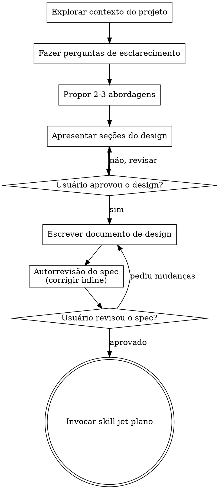

# JET Brainstorm — Transformar Ideias em Design

Skill própria do sistema de agentes da JET Digital para conduzir, em diálogo natural e colaborativo, a transformação de uma ideia em um design/spec pronto para virar plano de implementação.

Comece entendendo o contexto atual do projeto, depois faça perguntas uma de cada vez para refinar a ideia. Quando o design estiver claro, apresente-o e busque a aprovação do usuário.

<HARD-GATE>
NÃO invoque nenhuma skill de implementação, não escreva código, não faça scaffold de projeto, nem tome qualquer ação de implementação até apresentar um design e o usuário aprová-lo. Isso vale para TODO projeto, independentemente da simplicidade percebida.
</HARD-GATE>

## Anti-padrão: "isso é simples demais para precisar de design"

Todo projeto passa por esse processo. Uma lista de tarefas, uma função utilitária isolada, uma mudança de config — todos eles. Projetos "simples" são onde suposições não examinadas causam mais retrabalho. O design pode ser curto (algumas frases para projetos realmente simples), mas você DEVE apresentá-lo e obter aprovação.

## Checklist

Crie uma tarefa para cada item abaixo e complete-as em ordem:

1. **Explorar o contexto do projeto** — arquivos, docs, commits recentes
2. **Fazer perguntas de esclarecimento** — uma de cada vez, entendendo propósito/restrições/critérios de sucesso
3. **Propor 2-3 abordagens** — com trade-offs e sua recomendação
4. **Apresentar o design** — em seções proporcionais à complexidade, com aprovação do usuário após cada seção
5. **Escrever o documento de design** — salvar em `docs/aios-jet/specs/YYYY-MM-DD-<topico>-design.md` e commitar
6. **Autorrevisão do spec** — checagem rápida inline de placeholders, contradições, ambiguidade, escopo (ver abaixo)
7. **Usuário revisa o spec escrito** — pedir que o usuário revise o arquivo do spec antes de seguir
8. **Transição para implementação** — invocar a skill `jet-plano` para criar o plano de implementação

## Fluxo do processo

**O estado terminal é invocar `jet-plano`.** NÃO invoque skills de implementação, agentes de código ou qualquer outra skill de design. A ÚNICA skill invocada depois do brainstorm é `jet-plano`.

## O processo

**Entendendo a ideia:**

- Explore o estado atual do projeto primeiro (arquivos, docs, commits recentes)
- Antes de perguntas detalhadas, avalie o escopo: se o pedido descreve múltiplos subsistemas independentes (ex.: "construir uma plataforma com chat, storage, cobrança e analytics"), sinalize isso imediatamente. Não gaste perguntas refinando detalhes de um projeto que precisa ser decomposto primeiro.
- Se o projeto for grande demais para um único spec, ajude o usuário a decompor em subprojetos: quais são as partes independentes, como se relacionam, em que ordem devem ser construídas? Depois faça o brainstorm do primeiro subprojeto seguindo o fluxo normal. Cada subprojeto ganha seu próprio ciclo spec → plano → implementação.
- Para projetos com escopo adequado, faça perguntas uma de cada vez para refinar a ideia
- Prefira perguntas de múltipla escolha quando possível, mas perguntas abertas também servem
- Uma pergunta por mensagem — se um tópico precisa de mais exploração, quebre em várias perguntas
- Foque em entender: propósito, restrições, critérios de sucesso

**Explorando abordagens:**

- Proponha 2-3 abordagens diferentes com trade-offs
- Apresente as opções de forma conversacional, com sua recomendação e o raciocínio por trás dela
- Comece pela opção recomendada e explique o porquê

**Apresentando o design:**

- Quando você entender o que está sendo construído, apresente o design
- Escale cada seção conforme sua complexidade: algumas frases se for direto, até 200-300 palavras se for algo mais delicado
- Pergunte após cada seção se está fazendo sentido até ali
- Cubra: arquitetura, componentes, fluxo de dados, tratamento de erros, testes

**Design para isolamento e clareza:**

- Divida o sistema em unidades menores, cada uma com um propósito claro, que se comunicam por interfaces bem definidas e podem ser entendidas e testadas de forma independente
- Para cada unidade, você deve conseguir responder: o que ela faz, como se usa, e do que ela depende?
- Alguém consegue entender o que uma unidade faz sem ler seu interior? Dá para mudar o interior sem quebrar quem consome? Se não, as fronteiras precisam de ajuste.
- Unidades pequenas e bem delimitadas também facilitam o trabalho dos agentes JET — código que cabe no contexto de uma vez é mais fácil de raciocinar, e edições ficam mais confiáveis quando os arquivos são focados. Um arquivo crescendo demais costuma ser sinal de que está fazendo coisa demais.

**Trabalhando em bases de código existentes:**

- Explore a estrutura atual antes de propor mudanças. Siga os padrões já existentes.
- Onde o código existente tiver problemas que afetam o trabalho (arquivo que cresceu demais, fronteiras confusas, responsabilidades emaranhadas), inclua melhorias pontuais como parte do design — como faria um bom desenvolvedor melhorando o código em que está mexendo.
- Não proponha refatorações fora do escopo. Mantenha o foco no que serve ao objetivo atual.

## Depois do design

**Documentação:**

- Escreva o design validado (spec) em `docs/aios-jet/specs/YYYY-MM-DD-<topico>-design.md`
  - (Preferências do usuário sobre local do spec sobrescrevem esse padrão)
- Faça commit do documento de design no git

**Autorrevisão do spec:**
Depois de escrever o spec, releia com olhos frescos:

1. **Varredura de placeholder:** Há algum "TBD", "TODO", seção incompleta ou requisito vago? Corrija.
2. **Consistência interna:** Alguma seção contradiz outra? A arquitetura bate com as descrições das features?
3. **Checagem de escopo:** Está focado o suficiente para um único plano de implementação, ou precisa de decomposição?
4. **Checagem de ambiguidade:** Algum requisito pode ser interpretado de duas formas diferentes? Se sim, escolha uma e deixe explícita.

Corrija os problemas inline. Não precisa revisar de novo — só corrija e siga em frente. Se a correção alterar o arquivo, faça um novo commit antes do gate de revisão do usuário — a mensagem abaixo assume que o spec no disco já está commitado.

**Gate de revisão do usuário:**
Depois que a autorrevisão passar, peça que o usuário revise o spec escrito antes de seguir:

> "Spec escrito e commitado em `<caminho>`. Por favor revise e me diga se quer alguma mudança antes de partirmos para o plano de implementação."

Aguarde a resposta do usuário. Se ele pedir mudanças, faça-as e rode a autorrevisão de novo. Só siga adiante quando o usuário aprovar.

**Implementação:**

- Invoque a skill `jet-plano` para criar um plano de implementação detalhado
- NÃO invoque nenhuma outra skill. `jet-plano` é o próximo passo.

## Princípios-chave

- **Uma pergunta por vez** — não sobrecarregue com várias perguntas
- **Múltipla escolha preferida** — mais fácil de responder que perguntas abertas, quando possível
- **YAGNI sem dó** — remova funcionalidades desnecessárias de todos os designs
- **Explorar alternativas** — sempre proponha 2-3 abordagens antes de fechar
- **Validação incremental** — apresente o design, obtenha aprovação antes de seguir
- **Seja flexível** — volte e esclareça quando algo não fizer sentido

## Apoio visual (quando útil)

Nem toda pergunta de design se beneficia de imagem, mas perguntas de layout, wireframe ou comparação visual costumam ficar mais claras mostradas do que descritas. Quando isso acontecer, ofereça montar um mockup rápido — como um artifact HTML, um diagrama (ex.: mermaid/dot) ou um ASCII wireframe direto na conversa — em vez de tentar descrever tudo em texto corrido. Use esse recurso pontualmente, só quando a pergunta for genuinamente visual (layout, diagrama de arquitetura, comparação lado a lado); perguntas conceituais ou de escopo continuam sendo resolvidas em texto.
